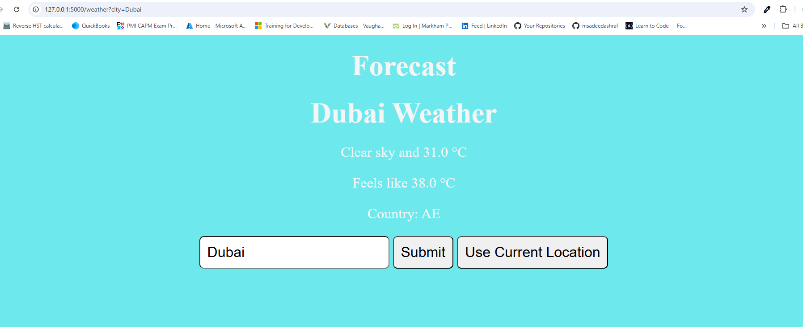

<a id="readme-top"></a>

<h1 align='center'>Weather App 🌤️</h1> 

<div align='center'>



<p align='center'>This is a simple weather application built using Python and Flask that allows users to search for weather by city or use their current location. The application fetches weather data from the OpenWeatherMap API and displays the current weather details.<br/>

<a href='https://github.com/AmberForrester/Python-Code/tree/main/day20/weatherApp'><strong>Source Code »</strong></a>
<br />
<br />
<a href='https://github.com/AmberForrester/Python-Code/issues/new?assignees=&labels=bug&projects=&template=bug-report-%F0%9F%90%9E.md&title='>Report Bug</a>
.
<a href='https://github.com/AmberForrester/Python-Code/issues/new?assignees=&labels=enhancement&projects=&template=feature-request-%F0%9F%9A%80.md&title='>Request Feature</a>
</p>
</div>

<details>
  <summary>Table of Contents</summary>
  <ol>
    <li><a href="#features">Features</a></li>
    <li><a href="#installation">Installation</a></li>
    <li><a href="#steps-to-install">Steps to Install</a></li>
    <li><a href="#how-to-run-the-application">How to Run the Application</a></li>
    <li><a href="#how-to-use">How to Use</a></li>
    <li><a href="#contributing">Contributing</a></li>
    <li><a href="#license">License</a></li>
    <li><a href="#acknowledgments">Acknowledgments</a></li>
  </ol>
</details>
<br />


## Features
- Search for weather by city.
- Get current weather based on user's geolocation.
- Displays weather status, temperature, and country.
<br />
<br />
A good understanding of Python and Pygame would be beneficial to helping you create this project. However, it is always good practice to refer to the Documentation available when developing ***any*** project. 

_Please refer to the [Python Documentation](https://docs.python.org/3/) for your reference._

_The standard shell of Python, or REPL (Read-Eval-Print Loop) allows you to run Python code interactively as you work on a project or are in the process of learning this programming language. You may find it useful to vist the [Getting the Most Out of the Python Standard REPL website](https://realpython.com/python-repl/) to further your understanding and produce better results._

<p align="right">(<a href="#readme-top">top of page</a>)</p>


## Installation

### Prerequisites

Before running the application, make sure you have the following installed:

- [Python >= 3](https://www.python.org/downloads/)
- [Flask](https://pypi.org/project/Flask/)
- [OpenWeatherMap API Key](https://openweathermap.org/api)


### Steps to Install

1. **Clone the Repository:**
  ```bash
  git clone https://github.com/AmberForrester/Python-Code.git
  ```

2. **Navigate to the project directory:**
  ```bash
  cd Python-Code/day20/weatherApp
  ```

2. **Set up a Virtual Environment:**

Create and activate a virtual environment to isolate your dependencies.

For **Windows**:
```bash
python -m venv env
env\Scripts\activate
```

For **Mac/Linux**:
```bash
python3 -m venv env
source env/bin/activate
```

3. **Install Required Dependencies:** 

- For **Windows users:** 

Install the required dependencies from `requirements.txt`.
  ```bash
  pip install -r requirements.txt
  ```

4. **Set Up Environment Variables**

Create a `.env` file in the root of your project with the following content:
```bash
API_KEY=your_openweathermap_api_key
```

Replace your `your_openweathermap_api_key` with your actual API key from OpenWeatherMap.

<p align="right">(<a href="#readme-top">top of page</a>)</p>


### How to Run the Application

Once everything is set up, you can start the Flask development server:

Open your terminal in the project directory and run the following command: 
```bash
flask run
```

By default, Flask runs on `http://127.0.0.1:5000/`. Open this URL in your browser to access the app.


## How to Use

1. **Search by City:** Enter a city name in the input field and click "Submit" to view the weather for that city.

2. **Use Current Location:** Click "Use Current Location" to get weather details based on your browser's geolocation.

<p align="right">(<a href="#readme-top">top of page</a>)</p>


### Contributing

I have learned that contributions are the heart of what makes the open source community such an amazing place! We are constantly able to learn, grow, inspire eachother, and create incredible things. Any contributions you make are **greatly appreciated**, we are so lucky to be here together.

If you have a suggestion that would make this project better, please fork the repo and create a pull request. You can also simply open an issue with the tag "enhancement".

1. Fork the Project
2. Create your Feature Branch (`git checkout -b feature/AmazingFeature`)
3. Commit your Changes (`git commit -m 'Add some AmazingFeature'`)
4. Push to the Branch (`git push origin feature/AmazingFeature`)
5. Open a Pull Request

Please, don't forget to give the project a :star:! 

I appreciate you!

<p align="right">(<a href="#readme-top">top of page</a>)</p>


### License

Distributed under the MIT License. See `LICENSE.txt` for more information.

<p align="right">(<a href="#readme-top">top of page</a>)</p>


### Acknowledgments

Please take some time to check out the links below! I found value in each and every one of them while creating this project, so my hope is that you will to!

* [Best README Template](https://github.com/othneildrew/Best-README-Template)
* [Basic Syntax: Markdown Guide](https://www.markdownguide.org/basic-syntax/#reference-style-links)
* [Formatting Syntax: GitHub](https://docs.github.com/en/get-started/writing-on-github/getting-started-with-writing-and-formatting-on-github/basic-writing-and-formatting-syntax)
* [Choose an Open Source License](https://choosealicense.com)
* [GitHub Emoji Cheat Sheet](https://github.com/ikatyang/emoji-cheat-sheet/blob/master/README.md#animal-bug)

<p align="right">(<a href="#readme-top">top of page</a>)</p>